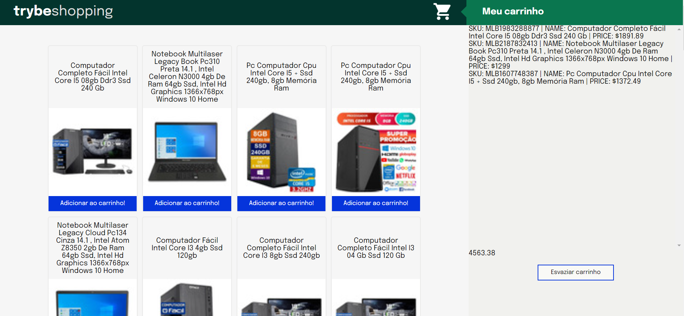

# Boas vindas ao repositório do projeto <b>Shopping Cart</b>!

Esse projeto foi desenvolvido durante o módulo de Fundamentos na Trybe! #vqv 

Aqui você vai encontrar os detalhes de como foi o desenvolvimento do projeto e quais foram os requisitos técnicos necessários para a entrega do desafio.



---

# Habilidades desenvolvidas

Neste projeto, fui capaz de:

- Fazer requisições a uma API (Application Programming Interface) do Mercado Livre;
- Utilizar os seus conhecimentos sobre JavaScript, CSS e HTML;
- Trabalhar com funções assíncronas;
- Implementar testes unitários.

---

# Funcionamento da aplicação

Para iniciar o projeto, é necessário rodar o comando
```
npm install
```
para que as dependências do projeto sejam instaladas.

Para rodar os testes do projeto, é necessário executar o comando
```
npm test
```
Aparecerá no terminal o resultado de todos os testes do projeto. Você também pode executar o teste de cada função separadamente, com o comando
```
npm test NOME_DO_ARQUIVO
```
Assim, somente os testes da função *NOME_DO_ARQUIVO* aparecerão no terminal.

Para visualizar o projeto no navegador, você pode utilizar a extensão `Live Server` do Visual Studio Code, que executará o arquivo `index.html` diretamente no navegador.

O projeto trata-se de um desafio para consolidar o todo o aprendizado dos fundamentos de JavaScript durante o curso da Trybe. Para isso, utilizei os conhecimentos em funções assíncronas para realizar chamadas à uma API (do Mercado Livre) e construir meu próprio Carrinho de Compras!

Também fiz uso de `Higher Order Functions` e muita manipulação de objeto!

---

# Requisitos técnicos do desafio:

- ✅ 1. Crie uma listagem de produtos.

- ✅ 2. Adicione o produto ao carrinho de compras.

- ✅ 3. Remova o item do carrinho de compras ao clicar nele.

- ✅ 4. Carregue o carrinho de compras através do LocalStorage ao iniciar a página.

- ✅ 5. Calcule o valor total dos itens do carrinho de compras.

- ✅ 6. Crie um botão para limpar o carrinho de compras.

- ✅ 7. Adicione um texto de "carregando" durante uma requisição à API.

- ✅ 8. Desenvolva testes de no mínimo 25% de cobertura total e 100% da função fetchProducts.

- ✅ 9. Desenvolva testes de no mínimo 50% de cobertura total e 100% da função fetchItem.

- ✅ 10. Desenvolva testes de no mínimo 75% de cobertura total e 100% da função saveCartItems.

- ✅ 11. Desenvolva testes para atingir 100% de cobertura total e 100% da função getSavedCartItems.
